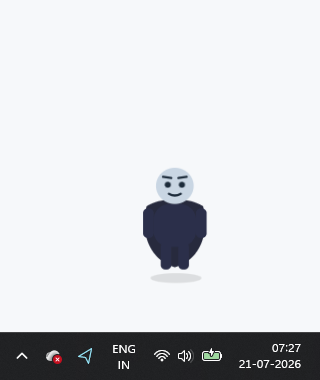
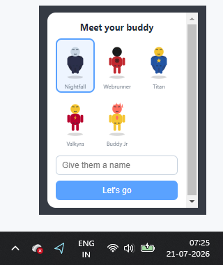

<div align="center">


# DeskBudd

**A tiny hero that walks over when you tune out.**

An animated desktop character that lives on your screen, reacts with real
expressions, and nudges you to drink water, take standup breaks, run focus
sessions, and catch reminders — on whichever monitor you're actually looking at.

[](LICENSE)
[](#download)
[](https://www.electronjs.org/)

[**⬇ Download for Windows**](../../releases/latest) · [Features](#features) · [Run from source](#run-from-source)



</div>

---

## Download

**[Download the latest release →](../../releases/latest)**

- **`DeskBudd Setup <version>.exe`** — a real installer: Start Menu + Desktop
  shortcuts, shows up in the taskbar with its own icon, and a normal entry in
  Windows' "Add or remove programs." Closing it from the taskbar quits it,
  same as any other app.
- **`DeskBudd-<version>-win.zip`** — portable alternative: unzip, run
  `DeskBudd.exe` directly, no install step.

Either way: no accounts, no sign-up, nothing phones home.

## Features



**Character & delivery**
- Five original characters — Nightfall, Webrunner, Titan, Valkyra, Buddy Jr —
  pick one on first launch and rename them whatever you like
- When a message arrives, your buddy **walks in**, does an **attention-grab
  jump + ping** (like someone knocking), then speaks — it doesn't just
  silently pop up
- **Emotion-aware face + posture** — calm for water breaks, excited for
  standup nudges, and friendly/urgent/excited/calm selectable per custom
  reminder
- **Multi-monitor aware** — relocates to whichever display currently has your
  mouse cursor before every message

**Productivity**
- Water and standup timers with an active-hours window (e.g. only 9am–6pm
  weekdays)
- Custom reminders: label + time + emotion
- **Focus sessions** (Pomodoro-style: 10/25/50 min) from the tray, with a
  countdown badge and quiet reminders while you're heads-down
- **Idle-aware "welcome back"** when you step away and return
- **Daily summary** of what you handled that day, at a time you set

**Engagement**
- Mood (0–100) that drifts down over time, boosted by acknowledging reminders
  or feeding your buddy a treat (🍪, capped per day)
- Streak tracking for consecutive days with at least one acknowledged reminder

**Customization**
- Size (small/medium/large), always-on-top toggle, reduce-motion for anyone
  who'd rather it just snap into place

**Voice ("hold and speak")**
- Hold the character down (don't drag) for about a third of a second and it
  starts listening — say something, let go, and it acts on it
- Speech-to-text runs **entirely on-device** (Whisper-tiny via WASM) — no API
  key, no account, no per-use network call; only a one-time model download
  (~150MB) the first time you use it, cached afterward
- Understands a fixed set of commands today (not open-ended chat): "start a
  focus session", "cancel focus", "feed [the buddy]", "how's my mood",
  "snooze", "remind me to _____ at _____"
- Replies out loud via your system's text-to-speech voices, plus the usual
  on-screen speech bubble

<br clear="right"/>

## Run from source

```bash
git clone https://github.com/prasanthb21/DeskBudd.git
cd DeskBudd
npm install
npm start
```

## Building your own package

```bash
npm run dist
```

Produces the portable zip locally without issue. The NSIS installer
(`.exe` Setup wizard) is built via [GitHub Actions](.github/workflows/release.yml)
instead of locally — a clean `windows-latest` runner doesn't hit the Windows
Defender block that a local build does (see the workflow file for why). Push
a `v*` tag or trigger the workflow manually to build both.

## Known limitations

- Voice commands are a fixed vocabulary (see above), not open-ended
  conversation — a natural next step would be routing the transcript through
  an LLM (e.g. Claude) instead, using your own API key, for far more flexible
  phrasing. Not done here to keep the base app free and dependency-light.
- The hold-to-talk flow was verified end-to-end for model loading, command
  parsing, and spoken replies — but actual microphone input wasn't tested
  with a live human voice in the environment this was built in (no physical
  mic available there). Worth a real test on your machine; open an issue if
  something doesn't sound right.

## Not built (by design)

- **No in-app purchases** — this is free, and executing payments isn't
  something bolted onto a hobby project casually
- **No gambling-style mini-games** — works against the whole point of a
  productivity tool
- **No telemetry, no accounts, no network calls** — everything runs and stores
  locally on your machine

## Contributing

Issues and PRs welcome. See [`renderer/characters.js`](renderer/characters.js)
for the character system, [`main.js`](main.js) for the reminder/focus/mood
logic, and [`renderer/stt.js`](renderer/stt.js) / [`renderer/voice.js`](renderer/voice.js) /
[`renderer/commands.js`](renderer/commands.js) for the voice pipeline.

## License

[MIT](LICENSE)
